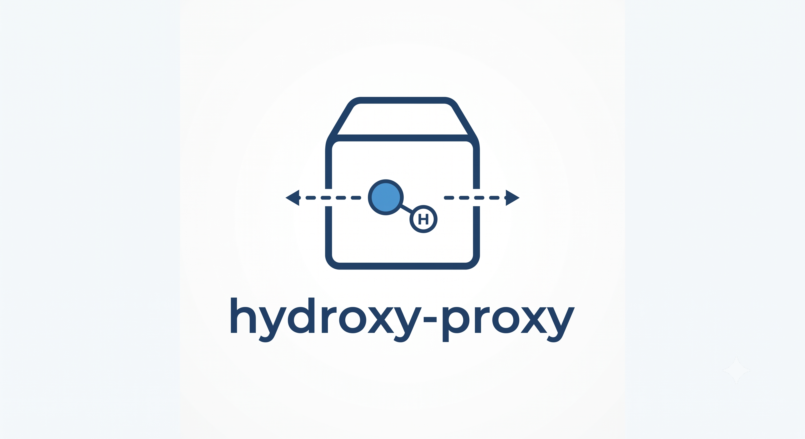
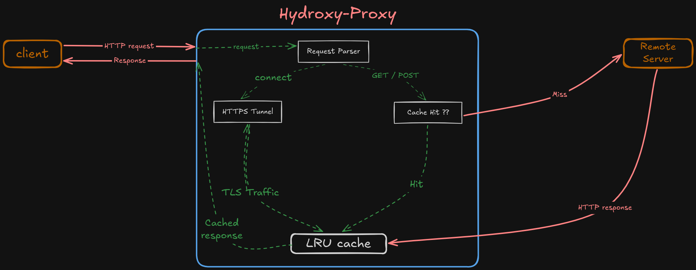
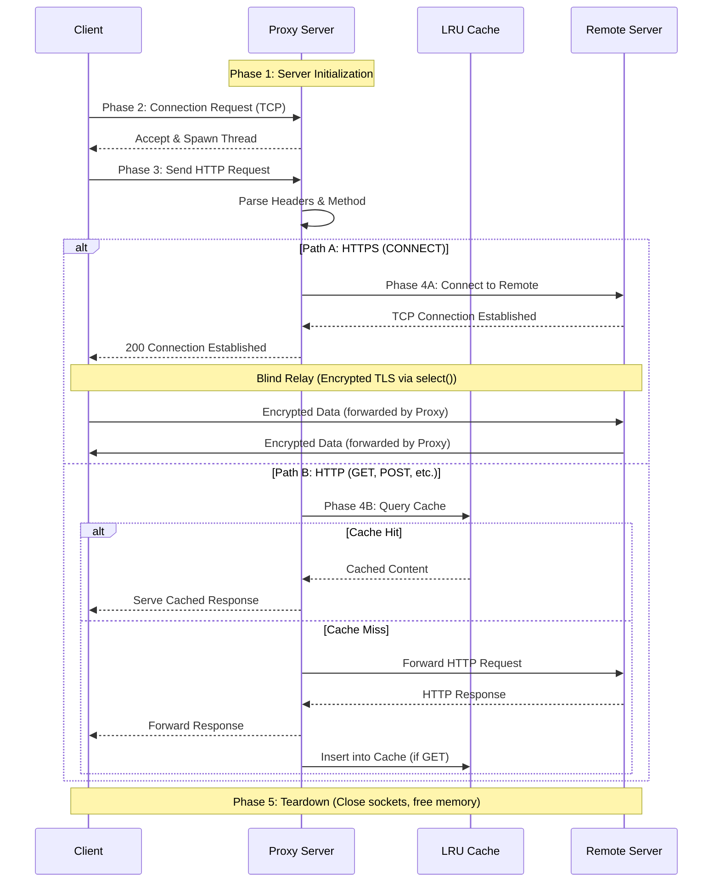

<p align="center"></p>


## Project Overview & Extensibility Framework

Hydroxy-Proxy is designed as a **generic, high-performance network container**. While it functions out-of-the-box as an HTTP/HTTPS proxy with O(1) caching, its core architecture multi-threaded connection pooling, raw socket multiplexing, and optimized data routing is built to serve as a foundational networking framework.

Because the socket lifecycle and traffic interception patterns are heavily decoupled, this container can be easily extended and modified to implement:
* **Load Balancers**: Distributing incoming TCP connections across a pool of upstream backend servers (Round Robin, Least Connections).
* **Firewalls & Content Filters**: Deep packet inspection, header manipulation, and domain blacklisting to drop malicious requests before they reach the internal network.
* **VPNs & Secure Tunnels**: Extending the existing `CONNECT` TLS relay to establish authenticated, end-to-end encrypted tunnels for private network access.
* **API Gateways**: Injecting rate limiting, authentication validation, and request logging modules into the pipeline.

## Core Framework Features

* **Generic Network Container**: A versatile base architecture ready to be extended into custom security or routing appliances.
* **Multi-threading**: Utilizes POSIX threads (pthread) and semaphores to handle multiple concurrent client connections without blocking.
* **HTTPS Tunneling**: Implements the HTTP CONNECT method utilizing the `select()` system call to establish a blind TCP relay for encrypted TLS traffic.
* **Algorithmic Caching**: Features a highly optimized O(1) Least Recently Used (LRU) cache to store and retrieve web responses.
* **Thread-Safe Logging**: Custom synchronized logging system to track requests, connections, and network states.

#### Code Architecture and Network Flow

<p align="center">

</p>


The execution of the proxy server follows a strict, multi-phased pipeline to manage connections, parse data, and route traffic.



**Phase 1: Server Initialization** (The Listening Socket)
1. Creation: The main() function calls socket(AF_INET, SOCK_STREAM, 0) to request a new IPv4 TCP socket from the kernel. This is the primary server socket (socketID).
2. Configuration: setsockopt() is applied with SO_REUSEADDR to prevent the "Address already in use" error if the proxy is restarted rapidly.
3. Binding & Listening: The socket is mapped to INADDR_ANY and the specified PORT using bind(). The server then enters a passive listening state via listen(), maintaining a queue of incoming client connection requests.

**Phase 2: Client Acceptance & Concurrency**
1. Acceptance: The main thread enters an infinite while(1) loop, calling accept(). When a client (e.g., a web browser) connects, the kernel generates a brand new socket specifically for this client (clientSocketID).
2. Concurrency Control: Before processing, the main thread dispatches a new POSIX thread (pthread_create) and passes the clientSocketID to the thread_fn routine.
3. Throttling: Inside thread_fn, a sem_wait(&semaphore) is immediately called. If the number of active threads exceeds MAX_CLIENTS, the thread sleeps until another connection closes, preventing resource exhaustion.

**Phase 3: Request Interception & Parsing**
1. Ingestion: The thread reads the raw HTTP text from the clientSocketID using recv() until it detects the \r\n\r\n sequence, which denotes the end of the HTTP headers.
2. Method Extraction: The raw buffer is scanned using sscanf() to identify the HTTP Method (e.g., GET, POST, CONNECT) and the target URI.
3. Parser Execution: For standard HTTP traffic, the buffer is passed to ParsedRequest_parse() (from proxy_parse.c), which tokenizes the headers into a dynamically allocated C structure, allowing the proxy to inject or modify headers (like forcing Connection: close).

**Phase 4: Routing & Upstream Connection**
Depending on the HTTP Method, the proxy splits into two distinct routing paths:

* Path A: HTTPS Traffic (CONNECT Method)
  1. The proxy acts as a blind relay. It extracts the target domain and port directly from the URI.
  2. A new socket (remoteSocketID) is created and connected to the destination server (e.g., www.google.com:443).
  3. The proxy sends a 200 Connection Established message back to the client.
  4. The handle_connect_tunnel() function is invoked. It uses select() to monitor both clientSocketID and remoteSocketID. When encrypted TLS bytes arrive on one socket, they are instantly forwarded to the other via send() and recv(), without any parsing.

* Path B: Standard HTTP Traffic (GET, POST, etc.)
  1. The thread queries the O(1) LRU Hash Map via find().
  2. Cache Hit: If the URL exists, the cached HTML/data is immediately written back to the clientSocketID.
  3. Cache Miss: A remoteSocketID is created and connected to the destination server. The modified HTTP headers and any payload body are sent upstream.
  4. The response from the upstream server is received in chunks, forwarded to the client, and simultaneously buffered in memory.
  5. Once the transfer completes, if the method was GET, the buffered response is inserted into the cache via addCache().

**Phase 5: Teardown**
1. Socket Closure: Once the transaction or tunnel completes, the thread calls shutdown(socket, SHUT_RDWR) to gracefully terminate TCP transmission, followed by close(socket) to return the file descriptor to the kernel.
2. Resource Release: Dynamically allocated memory buffers are passed to free().
3. Signal Completion: The thread executes sem_post(&semaphore) to increment the semaphore, waking up any pending connections waiting in the queue, and then safely exits.

### Cache Architecture Evolution

 A cache replacement policy that discards the least recently used items first. This algorithm requires keeping track of what was used when, which can be computationally expensive if not implemented with optimized data structures.


| Metric / Feature | Previous Architecture | Upgraded Architecture |
| :--- | :--- | :--- |
| Time Complexity | O(N) | O(1) Amortized |
| Lookup Structure | Singly Linked List | Hash Map (djb2 hashing algorithm) |
| Ordering Structure | Implicit (Time-based scan) | Doubly Linked List (DLL) |
| Lookup Mechanism | Linear traversal of all nodes | Direct array index access via hash |
| Eviction Mechanism | Iterate full list to find oldest time_t | Direct removal of the DLL tail pointer |
| CPU Time (Benchmark) | ~14,726 ns | ~6,327 ns (57% Reduction) |


## Installation & Setup

### Prerequisites
Before you begin, ensure you have the following installed on your system (Linux/Ubuntu recommended):
* **GCC** (GNU Compiler Collection)
* **Make** (Build automation tool)
* **libbenchmark-dev** (Optional, required only for running benchmarks)

You can install the required dependencies on Debian/Ubuntu-based systems using:
```bash
sudo apt update
sudo apt install build-essential libbenchmark-dev
```

### 1. Clone the Repository
```bash
git clone https://github.com/Kaushikmak/http_server_c.git
cd http_proxy_webserver
```

### 2. Compilation
Compile the main proxy executable using the provided Makefile:
```bash
make
```

### 3. Running the Server
Start the proxy server by specifying a listening port (e.g., `8080`):
```bash
./proxy 8080
```

### 4. Testing the Proxy
You can verify the proxy operation using `curl` from a separate terminal.

**Standard HTTP (Cacheable):**
```bash
curl -v -x http://localhost:8080 http://httpbin.org/get
```

**HTTPS Tunneling (Blind Relay):**
```bash
curl -v -x http://localhost:8080 https://www.google.com/
```

### 5. Benchmarking
To verify the O(1) cache performance and run the included tests, ensure `libbenchmark-dev` is installed and run:
```bash
make report
```

---

### Relevant Links
* HTTP CONNECT Method Specification: https://developer.mozilla.org/en-US/docs/Web/HTTP/Methods/CONNECT
* POSIX select() System Call: https://man7.org/linux/man-pages/man2/select.2.html
* Google Benchmark Documentation: https://github.com/google/benchmark
* HTTPS-PROXY library: https://github.com/sameer2800/HTTP-PROXY/tree/master